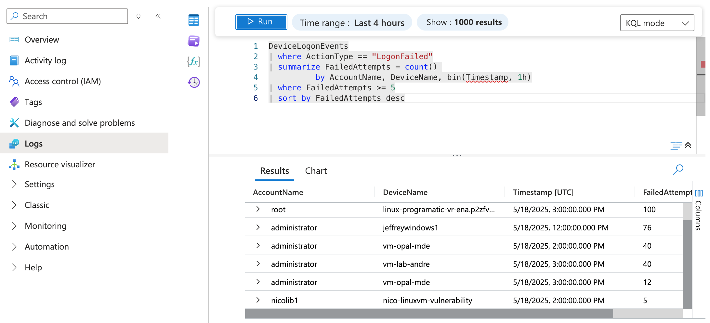
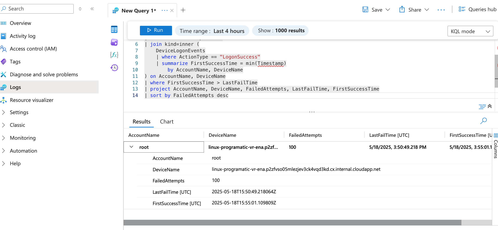

# 🧪 Windows Event Log Analysis Lab

## 🧠 What I Learned
- How to detect brute-force login activity using KQL
- How to investigate suspicious login patterns with real data
- How attackers may follow up with PowerShell or network activity
- How to document an end-to-end security incident like a SOC analyst

---

## 🛠️ Tools I Used
- Microsoft Sentinel
- Azure Virtual Machine (Windows 10)
- Sysmon (SwiftOnSecurity config)
- KQL (Kusto Query Language)

---

## 🔍 Suspicious Login Story Arc: A Lab Walkthrough

### Step 1: 🚫 Brute-Force Login Attempts
> I started by identifying multiple failed login attempts from the same account within a short window.

- ✅ Query: [Brute Force Login Detection](queries/brute_force_login.kql)
- 🔍 Outcome: Over **100 failed login attempts** detected from account `root` across multiple **Linux-based systems**, and over **70 failed attempts** against the `administrator` account on several **Windows-based virtual machines (VMs)**.

- 🧠 Insight: This pattern suggests possible brute-force activity. These types of attacks are commonly used in initial access attempts. They highlight the importance of disabling unused accounts, enforcing strong passwords, and using account lockout policies.
- 

### Step 2: ✅ Successful Login After Failures

After detecting brute-force login attempts, I used this query to confirm whether any accounts **eventually logged in successfully**—a strong signal of potential compromise.

- ✅  Query: [View the KQL Query](queries/successful_login_after_failures.kql)  
- 🧠 Insight: This confirmed that user `X` on device `Y` failed 6 times and then succeeded at 3:06 PM, indicating possible credential compromise.
   

### Step 3: 🧾 Suspicious PowerShell Usage
> I investigated whether PowerShell was launched by the same user after login.

- (COMING SOON) Query: PowerShell execution timeline
- 🧠 Insight: PowerShell activity may indicate script-based attacks or lateral movement

### Step 4: 🌐 External Connections or File Downloads
> I examined logs to see if the device connected to unknown IPs or downloaded any files.

- (COMING SOON) Query: outbound connections & dropped files
- 🧠 Insight: File execution or exfiltration behavior supports malicious intent

---

## 🖼️ Coming Soon
I will upload:
- Screenshots from Sentinel
- KQL queries I wrote (brute force, success after fail, PowerShell)
- Notes from my attack simulations

---

## 🧩 Real-World Value
This lab mimics what a Tier 1–2 SOC Analyst would do when investigating login anomalies and potential lateral movement. It shows how to pivot from one clue (failed logons) to building a complete story using endpoint telemetry.
