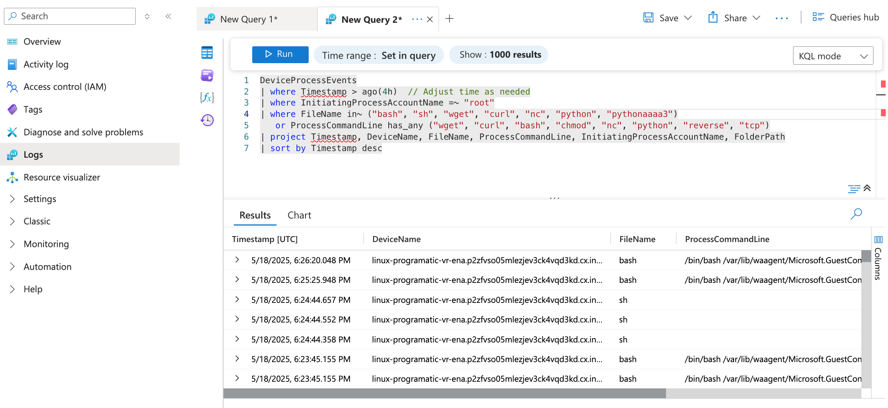

# 🧪 Windows Event Log Analysis Lab

## 🧠 What I Learned
- How to detect brute-force login activity using KQL
- How to investigate suspicious login patterns with real data
- How attackers may follow up with PowerShell or network activity
- How to document an end-to-end security incident like a SOC analyst

---

## 🛠️ Tools I Used
- Microsoft Sentinel
- Azure Virtual Machine (Windows 10)
- Sysmon (SwiftOnSecurity config)
- KQL (Kusto Query Language)

---

## 🔍 Suspicious Login Story Arc: A Lab Walkthrough

### Step 1: 🚫 Brute-Force Login Attempts
> I started by identifying multiple failed login attempts from the same account within a short window.

- ✅ Query: [Brute Force Login Detection](queries/brute_force_login.kql)
- 🔍 Outcome: Over **100 failed login attempts** detected from account `root` across multiple **Linux-based systems**, and over **70 failed attempts** against the `administrator` account on several **Windows-based virtual machines (VMs)**.

- 🧠 Insight: This pattern suggests possible brute-force activity. These types of attacks are commonly used in initial access attempts. They highlight the importance of disabling unused accounts, enforcing strong passwords, and using account lockout policies.
- 

### Step 2: ✅ Successful Login After Failures

After detecting brute-force login attempts, I used this query to confirm whether any accounts eventually logged in successfully—a strong signal of potential compromise.

- ✅ Query: [Successful Login After Failures](queries/successful_login_after_failures.kql)
- 🔍 Outcome: The `root` account on device `linux-programatic-vr-ena` failed **100 times** and then successfully logged in at **3:55 PM**, just 4 minutes after the last failed attempt at **3:50 PM**.
- 🧠 Insight: This confirmed a likely brute-force compromise. In a SOC environment, this would trigger escalation to incident response for containment and further investigation.
   

### Step 3: 🧨 Suspicious Post-Login Command Execution
After confirming a successful login by the `root` account, I analyzed system activity to determine whether the account executed any suspicious commands. This step investigates whether the attacker took further action after gaining access.

- ✅ Query: [Suspicious Process Execution](queries/suspicious_process_execution.kql)
- 🔍 Outcome: The `root` account on device `linux-programatic-vr-ena` launched multiple instances of `bash` and `sh` within minutes of logging in. Several of these processes were tied to the `waagent` directory, indicating a possible attempt to execute scripts or tamper with system services.
- 🧠 Insight: The repeated shell activity by `root` post-login suggests a high likelihood of attacker-driven command execution. The attacker may have been staging payloads or using the Azure guest agent path for post-exploitation tasks. In a real-world SOC environment, this pattern would justify immediate host isolation and forensic investigation. 

---

## 🖼️ Coming Soon
I will upload:
- Screenshots from Sentinel
- KQL queries I wrote (brute force, success after fail, PowerShell)
- Notes from my attack simulations

---

## 🧩 Real-World Value
This lab mimics what a Tier 1–2 SOC Analyst would do when investigating login anomalies and potential lateral movement. It shows how to pivot from one clue (failed logons) to building a complete story using endpoint telemetry.
